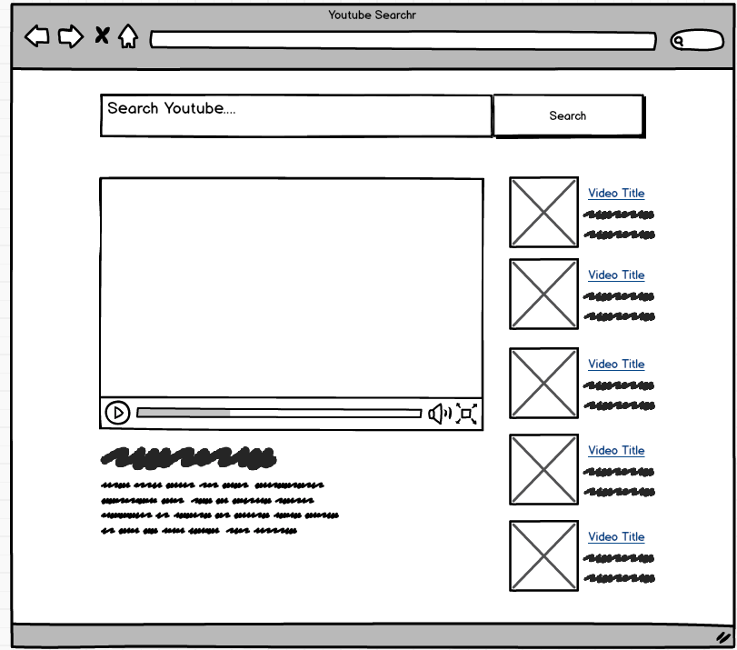

# Youtube Example App



## A few things of note

#### iframes are weird

iframes are a little bit picky about the url you use for the `src` attribute.
To get the video to render be sure to set up the embedUrl along the lines of:

```js
// videoId is coming from the api response,
// to be found at .id.videoId
const embedUrl = `https://www.youtube.com/embed/${videoId}`;

// in the JSX
<iframe src={embedUrl} />
```
#### Build out static app before adding api communication

There is an example API response in index.js

When building app with students, try to follow something along the lines of the steps described in *Thinking in React* for building any React application

1. Break the app into components
2. Build a static version of the app
3. Determine what should be stateful
4. Determine in which component each piece of state should live
5. Hard-code initial states
6. Add inverse data flow
7. Add server communication

i.e. add some static initial state and only add in fetch request after

#### api key

create a file in the `src` directory called `keys.js`.

The code inside mine is:

```js
export default {
  API_KEY: `<API Key here>`
};

```

#### lodash debounce

lodash debounce method is a cool feature to add (time permitting):

```js
//_.debounce is passed a function and an amount of time (n) in milliseconds.
// it will retunr a copy of the passed in function that can only be called
// once per n seconds

const videoSearch = _.debounce(term => {
  this.videoSearch(term);
}, 200);

// videoSearch is now a function you can pass as the callback prop
```
